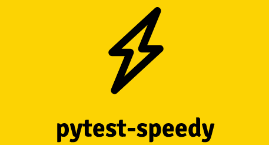

# pytest-speedy

## Overview of pytest-speedy

A pytest plug-in that checks the tests with the fastest efficiency first.

## General Description

(Add in the purpose of pytest-speedy)

## Features

(Add in features about pytest-speedy)

## Usage of pytest-speedy

(Add in details about what version of Python the plug-in is configured too as
  well as how to update or install Python)
